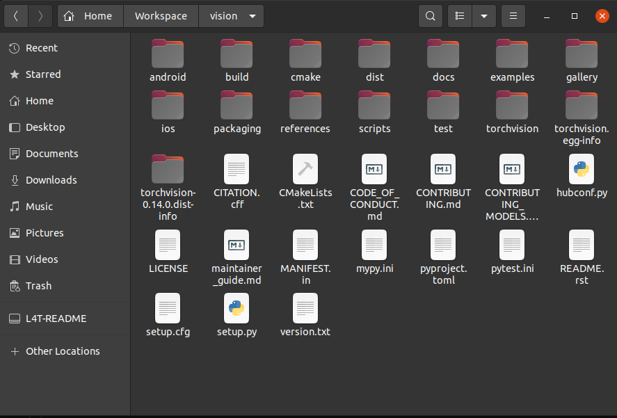

# torchvision-to-jetson

Replace _```torchvision```_ and _```torchvision.egg-info```_ directory by the _```torchvision```_ and _```torchvision-0.14.0.dist-info```_, respectively in this rep. 


There is a helpfull [link](https://forums.developer.nvidia.com/t/pytorch-for-jetson/72048)
